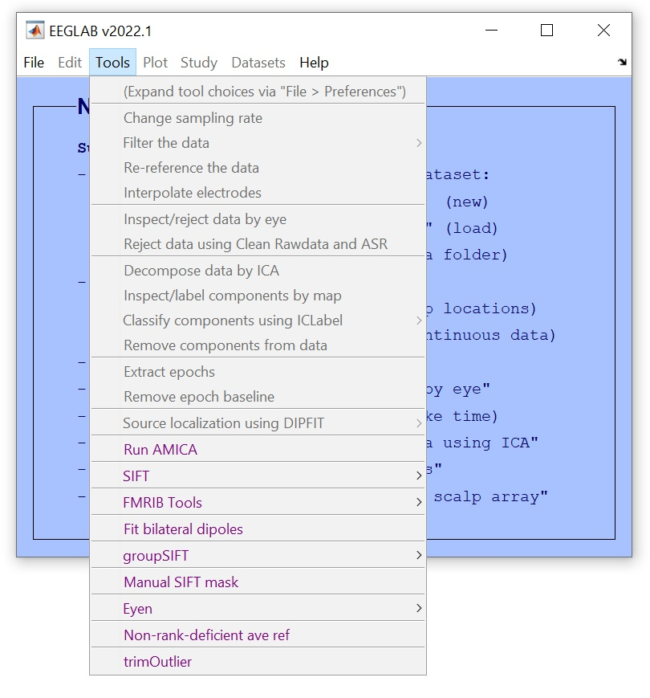
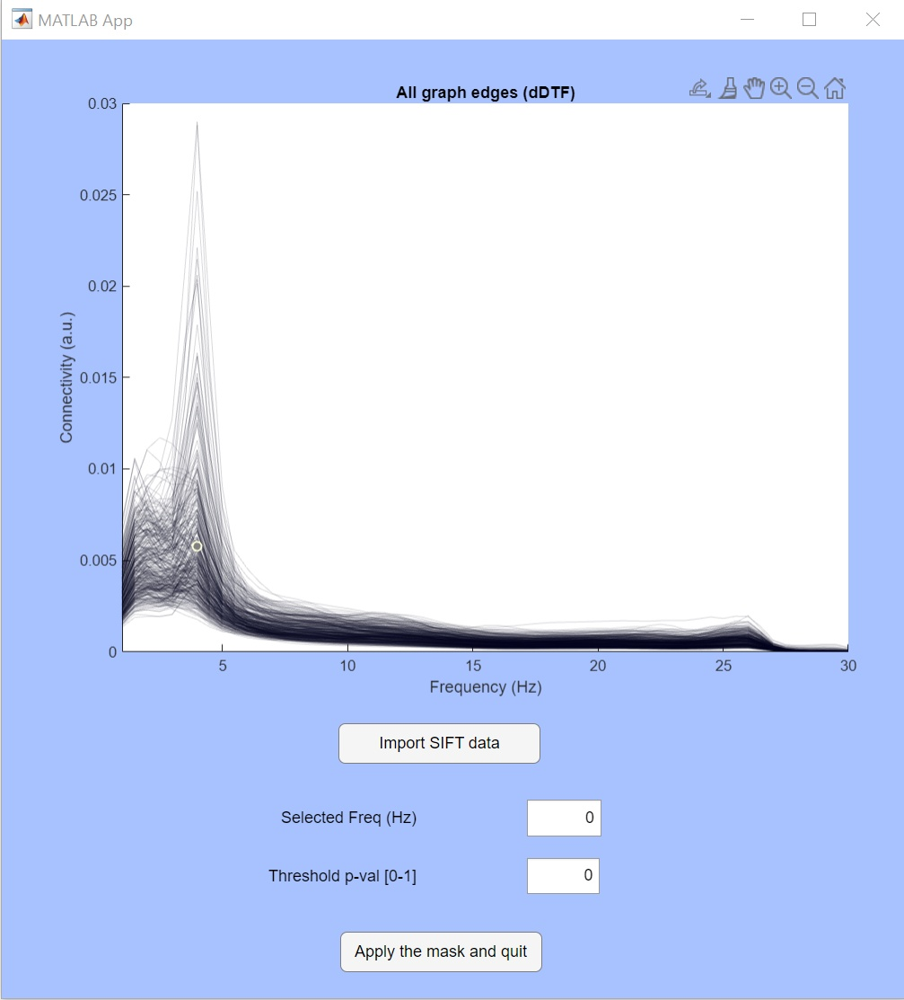
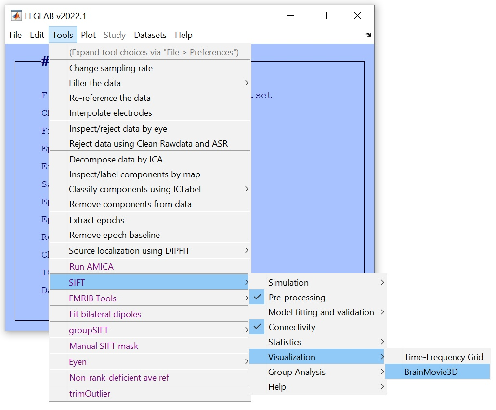
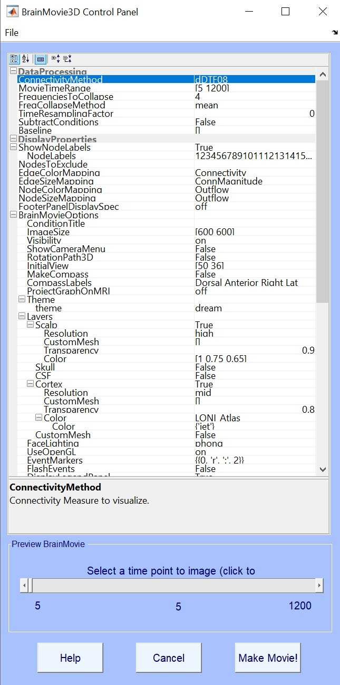
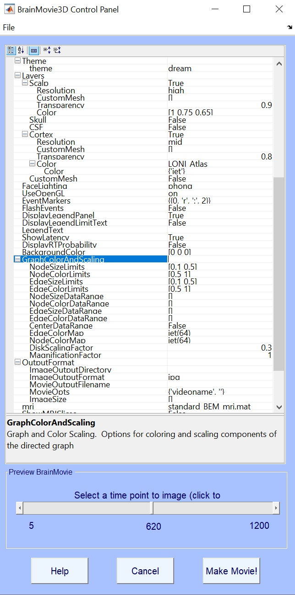
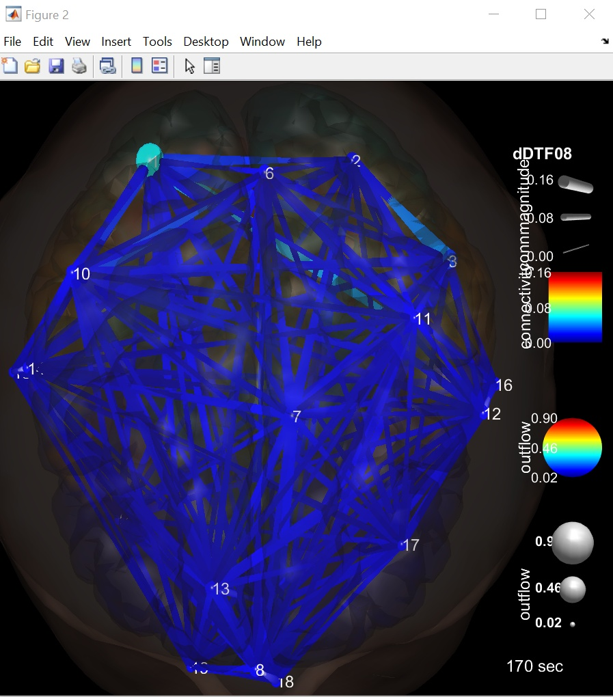
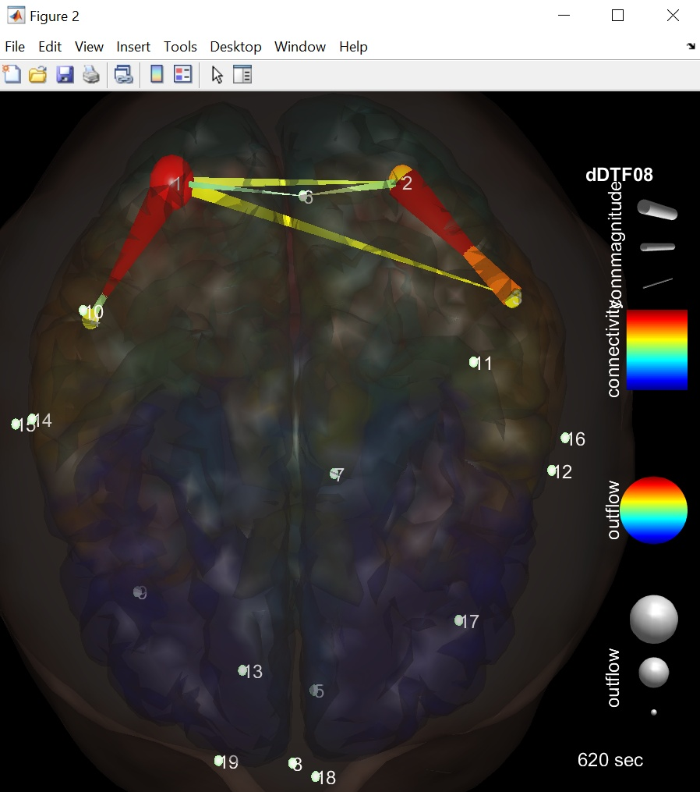

# manualSiftMask()

Designed to
=================================
1. Show a butterfly plot of frequency-domain (i.e. time averaged time-frequency decomposed) dDTF08. 
2. Deteremine and apply statistical significance for a given single frequency bin.

How to install the function
================================
1. Download the folder of this plugin from this site.
2. Go to the directory [eeglabroot]/eeglab/plugins
3. Paste the folder in this directry.
4. Re-launch EEGLAB.
   
How to use the function
===============================
When the plugin is successfully installed, you see the item 'Manual SIFT mask' under 'Tools'.

Load a dataset with pre-computed dDTF results, then launch this plugin. Press 'Import SIFT data' button and you see the butterfly plot of time-averaged dDTF08 from all graph edges.

Now you determine which frequency bin to analyze by sepcifying the frequency bin [Hz]. This adds a fine vertical red line to highlight the freq bin selected.

Now you specify the cutoff p-values (the right-hand tail only for now). This p-value indicates deviation from zero (i.e. equivalent of one-sample t-test).

Now you apply the selection by pressing the button 'Apply the mask and quit'. The graph edges that do not survive will be masked with zeros. This change cannot be redone. If you make a mistake, load the data again. Be careful not to overwrite existing data with the masked data!

Now you open 'Brain Movie 3D' from EEGLAB menu. Note that we are NOT going to generate a movie. The data we use here is a resting. We will show a time averaged, stationary representation.

Now you set visualization parameters.
(Top) 'ConnectivityMethod', 'dDTF08'
(3rd item) 'FrequenciesToCollapse', 4: This is because we saw our results show a peak at 4 Hz.

Continued... you should scroll down to see more items.
(middle) 'NodeSizeLimits', [0.1 0.5]
(one below) 'NodeColorLimits', [0.5 1] This is because we know we will see an interested in increase of information flow. We just want to use warm colors.
(one below) 'EdgeSizeLimits', [0.1 0.5]
(one below) 'EdgeColorLimits', [0.5 1]

Here is the default output at 4 Hz. Completely saturated and not usable. By the way, this is a 19 x 19 connectivity grid.

Here is uncorrected p<0.001 masked. The frontal network is nicely highlighted.

03/06/2024 Makoto Miyakoshi.
